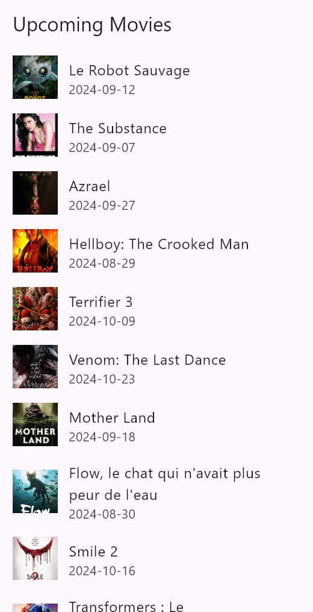
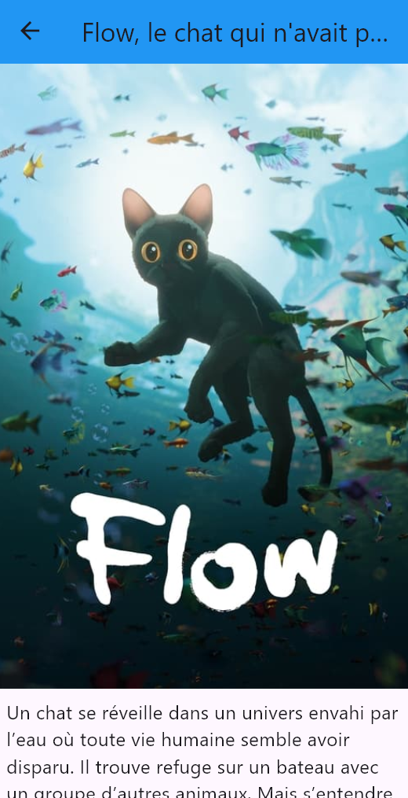

# flutter_movie_manip

<div align="center">
    
    
</div>

Bienvenue dans le projet **Flutter Movie Manip** ! Ce projet a pour but d'explorer les concepts clés de Flutter tout en construisant une application qui récupère les films à venir à partir de l'API [The Movie Database (TMDb)](https://www.themoviedb.org/).

## Objectifs pédagogiques

Ce projet a été conçu dans le cadre d'un cours de Flutter afin de pratiquer et comprendre les notions suivantes :

1. **Stateless vs Stateful Widgets** : comprendre la différence entre des widgets statiques et ceux dont l'état peut changer.
2. **Appels HTTP dans Flutter** : apprendre à faire des requêtes à une API externe.
3. **Gestion de l'état** : manipulation de l'état dans une application Flutter via `setState`.
4. **Affichage dynamique avec `ListView.builder`** : utilisation de ce widget pour générer des listes dynamiques basées sur des données reçues d'une API.
5. **Utilisation d'environnements avec `flutter_dotenv`** : apprendre à gérer des informations sensibles comme les clés d'API.

---

## Prérequis

Avant de commencer, assurez-vous d'avoir les éléments suivants installés :

- [Flutter SDK](https://flutter.dev/docs/get-started/install)
- [Android Studio ou Visual Studio Code](https://flutter.dev/docs/get-started/editor) avec les plugins Flutter et Dart
- Un compte sur [The Movie Database (TMDb)](https://www.themoviedb.org/)

---

## Mise en place du projet

### Étape 1 : Cloner le projet

Clonez ce dépôt en utilisant la commande suivante dans votre terminal :

```bash
git clone https://github.com/ton-repo/flutter_movie_manip.git
```

### Étape 2 : Installation des dépendances

Dans le répertoire du projet, exécutez la commande suivante pour installer les dépendances du projet Flutter :

```bash
flutter pub get
```

### Étape 3 : Configuration de l'API

Ce projet utilise l'API de The Movie Database pour récupérer la liste des films à venir. Vous devez obtenir une clé API en suivant les étapes ci-dessous :

1. Inscrivez-vous sur The Movie Database (TMDb).
2. Rendez-vous dans la section API de votre compte pour générer votre clé API.
3. Créez un fichier `.env` dans le répertoire racine du projet et ajoutez votre clé API comme suit :

```env
API_KEY=your_api_key_here
```

### Étape 4 : Lancer l'application

Pour démarrer l'application, exécutez la commande suivante dans votre terminal :

```bash
flutter run
```

## Structure du projet

- `main.dart` : point d'entrée de l'application. On y initialise Flutter et charge la clé API avec le package `flutter_dotenv`.
- `home_page.dart` : page principale qui affiche la liste des films récupérés via un appel HTTP. C'est ici que sont appliqués les concepts de **widgets Stateful** et la **gestion de l'état**.
- `http_helper.dart` : classe utilitaire pour gérer les appels HTTP à l'API TMDb avec `http` et convertir la réponse JSON en une liste d'objets `Movie`.
- `model/movie.dart` : modèle de données pour représenter un film, en accord avec les données reçues depuis l'API.

---

## Concepts clés

### 1. Stateful Widgets et `setState()`

Dans Flutter, un widget peut être **Stateful** ou **Stateless**. Ce projet utilise un **StatefulWidget** dans `home_page.dart` pour maintenir la liste des films à jour. Chaque fois que les données des films sont récupérées, la méthode `setState()` est appelée pour mettre à jour l'interface utilisateur. Pour en savoir plus, consultez la documentation Flutter : [StatefulWidget](https://docs.flutter.dev/development/ui/widgets-intro#stateful-and-stateless-widgets).

### 2. Appels HTTP et gestion des données

Pour communiquer avec une API externe, nous utilisons le package [http](https://pub.dev/packages/http). L'appel HTTP se fait dans `http_helper.dart`, où nous envoyons une requête GET pour obtenir les films à venir. La réponse, au format JSON, est décodée puis transformée en objets Dart à l'aide de `Movie.fromJson()`. Pour plus d'informations sur l'utilisation d'HTTP dans Flutter, visitez [Making HTTP Requests](https://docs.flutter.dev/cookbook/networking/fetch-data).

### 3. Gestion des environnements avec `flutter_dotenv`

Afin de sécuriser la clé API, le package `flutter_dotenv` est utilisé pour charger les variables d'environnement. Cela permet de garder les informations sensibles hors du code source. [flutter_dotenv](https://pub.dev/packages/flutter_dotenv) est utile pour la gestion des environnements de développement et production.

### 4. Affichage dynamique avec `ListView.builder`

Le widget `ListView.builder` est utilisé pour afficher une liste de films récupérés de manière dynamique. Ce widget est efficace pour les listes longues ou lorsque le nombre d'éléments à afficher peut varier. [ListView.builder Documentation](https://docs.flutter.dev/cookbook/lists/long-lists).

---

## Ressources supplémentaires

- [Cours Flutter officiel](https://docs.flutter.dev)
- [Package HTTP](https://pub.dev/packages/http)
- [TMDb API Documentation](https://developers.themoviedb.org/3)

Pour en savoir plus sur Flutter, consultez la documentation officielle : [flutter.dev](https://flutter.dev/docs).
